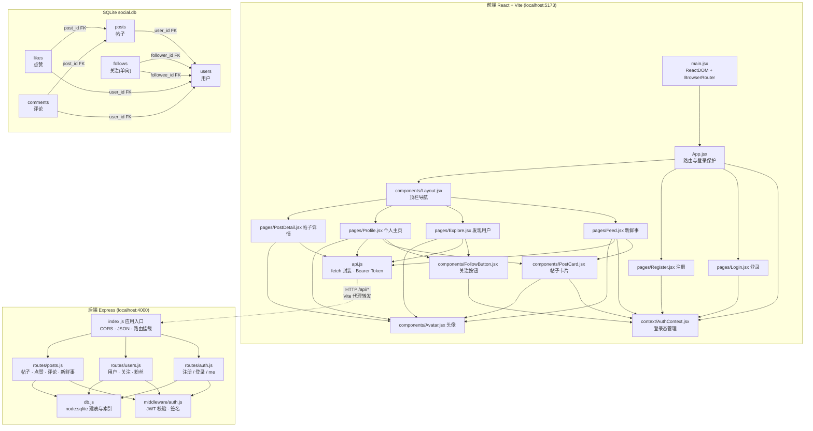

# 微圈 · 系统架构依赖图

## API 一览

| 方法 | 路径 | 说明 |
| --- | --- | --- |
| POST | /api/auth/register | 注册，返回 token |
| POST | /api/auth/login | 登录，返回 token |
| GET | /api/auth/me | 当前用户信息 |
| GET | /api/users?q= | 用户列表 / 搜索 |
| GET | /api/users/:id | 用户资料 + 其帖子 |
| POST/DELETE | /api/users/:id/follow | 关注 / 取关 |
| GET | /api/users/:id/followers / following | 粉丝 / 关注列表 |
| POST | /api/posts | 发帖 |
| GET | /api/posts/feed | 新鲜事（本人 + 关注者） |
| GET/DELETE | /api/posts/:id | 帖子详情 / 删除 |
| POST/DELETE | /api/posts/:id/like | 点赞 / 取消 |
| POST | /api/posts/:id/comments | 发表评论 |
