# 微圈 · 能力地图

> 平台能力按功能域组织，每项能力标注对应的后端接口与前端页面。

```mermaid
flowchart TD
    Platform["微圈 社交平台"]

    Platform --> Auth["认证域"]
    Platform --> Content["内容发布域"]
    Platform --> Social["社交关系域"]
    Platform --> Engage["互动域"]
    Platform --> Feed["信息流域"]
    Platform --> Discover["用户发现域"]
    Platform --> Guard["安全与校验域"]

    Auth --> C1["注册<br/>POST /auth/register"]
    Auth --> C2["登录<br/>POST /auth/login"]
    Auth --> C3["退出（前端清理 token）"]
    Auth --> C4["获取当前用户<br/>GET /auth/me"]
    Auth --> C5["JWT 会话保持（7 天）"]

    Content --> C6["发帖<br/>POST /posts"]
    Content --> C7["删帖（仅本人）<br/>DELETE /posts/:id"]
    Content --> C8["帖子详情<br/>GET /posts/:id"]
    Content --> C9["单帖计数（赞/评）"]

    Social --> C10["关注（单向）<br/>POST /users/:id/follow"]
    Social --> C11["取关<br/>DELETE /users/:id/follow"]
    Social --> C12["粉丝列表<br/>GET /users/:id/followers"]
    Social --> C13["关注列表<br/>GET /users/:id/following"]
    Social --> C14["互关 / 回关标识<br/>follows_me + is_following"]
    Social --> C15["禁止关注自己"]

    Engage --> C16["点赞 / 取消点赞<br/>POST/DELETE /posts/:id/like"]
    Engage --> C17["发表评论<br/>POST /posts/:id/comments"]
    Engage --> C18["评论列表<br/>GET /posts/:id"]

    Feed --> C19["新鲜事（本人 + 关注者）<br/>GET /posts/feed"]
    Feed --> C20["按时间倒序"]
    Feed --> C21["分页 limit/offset"]

    Discover --> C22["用户列表 / 搜索<br/>GET /users?q="]
    Discover --> C23["粉丝数 / 关注数展示"]
    Discover --> C24["用户资料<br/>GET /users/:id"]

    Guard --> C25["bcrypt 密码加密"]
    Guard --> C26["JWT 接口鉴权"]
    Guard --> C27["越权保护（删他人帖 / 越权操作）"]
    Guard --> C28["输入校验（长度 / 非法字符 / 空值）"]
```

## 能力清单

| # | 能力 | 类型 | 后端接口 | 前端页面 | 需求对应 |
| --- | --- | --- | --- | --- | --- |
| 1 | 注册 | 认证 | POST /auth/register | Register | 需求① |
| 2 | 登录 / 退出 | 认证 | POST /auth/login | Login | 需求① |
| 3 | 会话保持 | 认证 | JWT 7 天 | AuthContext | 需求① |
| 4 | 发帖 | 内容 | POST /posts | Feed | 需求② |
| 5 | 删帖（仅本人） | 内容 | DELETE /posts/:id | Feed / Profile / PostDetail | 需求② |
| 6 | 单向关注 | 社交 | POST /users/:id/follow | Explore / Profile | 需求③ |
| 7 | 取关 | 社交 | DELETE /users/:id/follow | Explore / Profile | 需求③ |
| 8 | 粉丝 / 关注列表 | 社交 | GET /users/:id/followers\|following | Profile 弹窗 | 需求③ |
| 9 | 点赞 / 取消 | 互动 | POST/DELETE /posts/:id/like | Feed / PostDetail | 需求④ |
| 10 | 评论 | 互动 | POST /posts/:id/comments | PostDetail | 需求④ |
| 11 | 新鲜事流 | 信息流 | GET /posts/feed | Feed | 需求⑤ |
| 12 | 用户搜索 | 发现 | GET /users?q= | Explore | 需求③⑤ |
| 13 | 数据安全 | 安全 | bcrypt + JWT + 越权拦截 | — | 全局 |

## 能力域到需求的映射

| 原始需求 | 覆盖能力 |
| --- | --- |
| ① 登录、注册 | 注册、登录、退出、会话保持 |
| ② 发帖 | 发帖、删帖、详情 |
| ③ 关注好友（单向） | 关注、取关、粉丝/关注列表、互关标识 |
| ④ 点赞和评论 | 点赞/取消、评论、计数 |
| ⑤ 查看好友新鲜事 | 新鲜事流（本人+关注者）、时间倒序、分页 |
