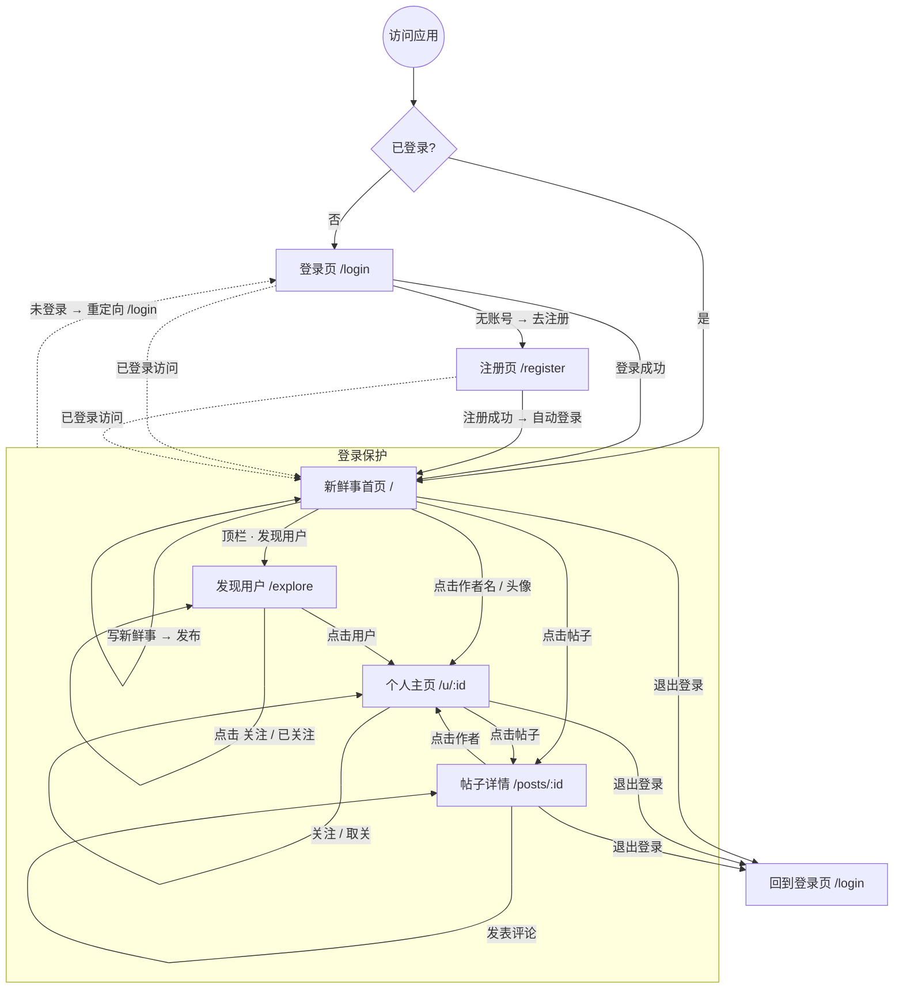

# 微圈 · 导航地图

> 用户如何进入、浏览并完成各个操作；实线为主流程，虚线为受保护的跳转。

## 页面与路由

| 页面 | 路由 | 访问条件 | 主要入口 |
| --- | --- | --- | --- |
| 登录 | /login | 未登录 | 首次访问、退出后 |
| 注册 | /register | 未登录 | 登录页「立即注册」 |
| 新鲜事（信息流） | / | 需登录 | 登录后默认落地页 |
| 发现用户 | /explore | 需登录 | 顶栏导航 |
| 个人主页 | /u/:id | 需登录 | 点击任何作者名 / 头像 |
| 帖子详情 | /posts/:id | 需登录 | 点击帖子正文 / 评论数 |

## 关键用户旅程

1. **新用户**：注册（填用户名/昵称/密码/签名）→ 自动登录 → 进入空信息流 → 去「发现用户」关注好友。
2. **内容消费**：进入首页 → 浏览新鲜事 → 点进帖子详情 → 点赞、评论。
3. **社交连接**：搜索用户 → 关注 → 对方发帖后出现在自己信息流；粉丝数实时更新。
4. **内容生产**：首页顶部发帖框 → 发布 → 即时出现在自己的新鲜事顶部；可删除自己的帖子。
